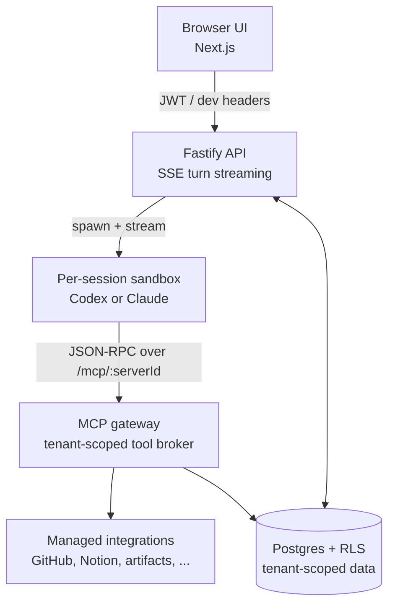

# Cogniplane Core

[](https://github.com/Cogniplane/cogniplane-core/actions/workflows/ci.yml)
[](LICENSE)
[](COMMERCIAL.md)

**Multi-tenant agent platform for running Codex and Claude agents at scale, with managed integrations, approvals, and audit logging.**

Running production agent platforms is harder than running a chat UI. You need per-session sandboxes, an MCP gateway that doesn't leak tenant credentials, human-in-the-loop approvals on tool calls, multi-tenant isolation that survives a query that forgets to filter by tenant, and an audit trail your security team can actually read. Cogniplane Core ships all of that as one cohesive system — pick the runtime (Codex or Claude), wire in your MCP servers and skills, and you have a governed agent backend.

> _A 60-second demo walkthrough is coming with the public launch. Check back at [cogniplane.ai](https://cogniplane.ai) or watch the launch post._

## Quickstart

```bash
git clone https://github.com/Cogniplane/cogniplane-core.git
cd cogniplane-core
pnpm install
cp apps/backend/.env.example apps/backend/.env
cp apps/frontend/.env.example apps/frontend/.env.local
make dev
```

Backend on `http://localhost:3001`, frontend on `http://localhost:3000`, admin workbench on `http://localhost:3000/admin`. `make dev` starts Postgres in Docker, runs migrations, and starts both servers.

Codex needs `OPENAI_API_KEY`, Claude needs `ANTHROPIC_API_KEY` (paid keys, no free tier; consumer Claude Free/Pro/Max not supported). Set them in `apps/backend/.env`.

Anthropic's [Commercial Terms of Service](https://www.anthropic.com/legal/commercial-terms) governs Claude SDK use. See [docs/getting-started.md](docs/getting-started.md) for the full walkthrough — including per-tenant key configuration, provider links, and troubleshooting.

## Architecture



Every turn runs in a per-session sandbox. Tool calls go through a tenant-scoped MCP gateway that injects credentials from compiled tenant config — the model never sees raw secrets. Postgres Row-Level Security is the second line of defense behind explicit `tenant_id` filtering.

## What's in the box

- **Two runtimes, one platform.** Codex (`@openai/codex`) and Claude (`@anthropic-ai/claude-agent-sdk`) both run in the same E2B sandbox image. Pick per tenant. Switch later.
- **Managed integrations.** GitHub, Notion, artifact upload/download, session context, and a write-artifact tool — credentials brokered server-side, never exposed to the model.
- **Human-in-the-loop approvals.** Native runtime approvals plus Policy Center rules with tenant-level monitor/enforce mode. Frontend renders approval cards inline in the turn.
- **Multi-tenant by default.** Every store method takes `tenantId`. Every query runs inside a `withTenantScope` block that activates Postgres RLS. Migrations bypass RLS as superuser; runtime app role does not.
- **Skills as content.** Authored as structured operating documents, compiled into `SKILL.md` bundles materialized into the sandbox workspace per turn. Skill bundles can live on local disk or in S3.
- **Auth modes.** WorkOS SSO (JWT access + rotating httpOnly refresh + Redis `jti` revocation) for production; dev-headers mode for local hacking.
- **Audit trail.** Tool results redacted before persistence. Every approval, tool call, and turn is logged with IP capture.
- **Rate limits + quotas.** Per-user and per-tenant request limits; daily turn quotas. Redis-backed when configured, in-memory otherwise.

## Stack

`pnpm` workspace · `Node.js 24 LTS` · `Fastify` + `Next.js` · `Postgres` (RLS) · `Redis` (optional) · `WorkOS` (optional) · `E2B` sandboxes · `@openai/codex` and `@anthropic-ai/claude-agent-sdk`.

Deeper architecture notes live in [docs/ARCHITECTURE.md](docs/ARCHITECTURE.md).

## License

Cogniplane Core is dual-licensed:

- **GNU AGPL-3.0** — free to use, modify, and self-host. If you offer it as a network service, you must release your modifications under the AGPL. See [LICENSE](LICENSE).
- **Commercial license** — proprietary terms for organizations that can't or don't want to comply with the AGPL (for example, building closed-source products on top of Cogniplane Core). See [COMMERCIAL.md](COMMERCIAL.md) or contact `licensing@cogniplane.ai`.

Third-party dependencies and their licenses are inventoried in [THIRD_PARTY_NOTICES.md](THIRD_PARTY_NOTICES.md).

## Run it yourself, or use Cogniplane Cloud

Cogniplane Core is the same backend that powers [Cogniplane Cloud](https://cogniplane.ai/oss) — a hosted version with SSO, managed integrations (Microsoft connectors, private PII detection that doesn't send data to third-party inference APIs), and dedicated support. Run the open source yourself, or skip the operations and use the hosted version.

## Contributing

Contributions are welcome. Please read [CONTRIBUTING.md](CONTRIBUTING.md) before opening a pull request — Cogniplane Core requires a signed Contributor License Agreement (CLA) so we can offer the dual-license terms above.

For security issues, please follow the responsible disclosure process in [SECURITY.md](SECURITY.md).
