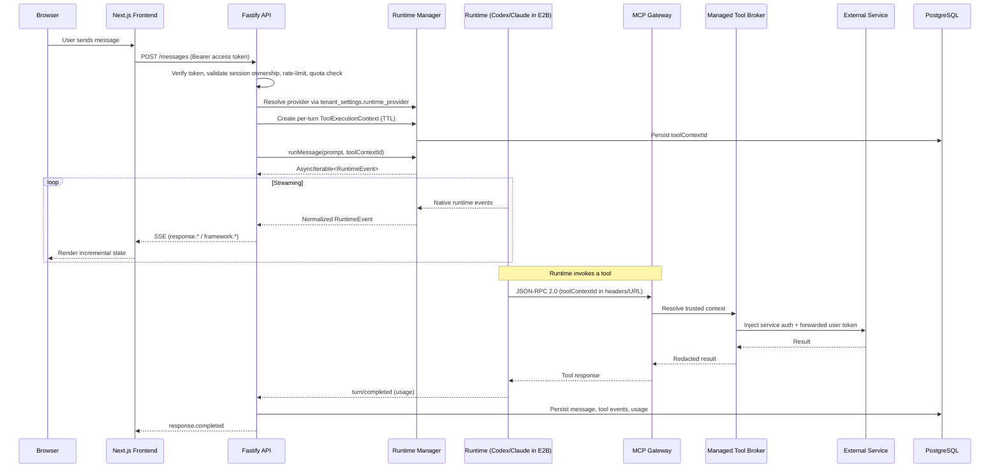

# Cogniplane Architecture

> **Scope:** The shipped architecture of Cogniplane Core. Operational details (commands, file paths, env vars) live in `CLAUDE.md`. Authoritative schema lives in `apps/backend/db/migrations/`.

## Overview

Cogniplane Core is a multi-tenant agent platform with a backend-controlled agent runtime. The backend owns auth, persistence, tool security, session lifecycle, policy compilation, event normalization, and the admin control plane. The runtime provides multi-step planning, tool orchestration, approvals, and richer streaming behavior than a thin LLM-plus-tool-loop stack.

Two runtime providers are supported, selected per tenant via `tenant_settings.runtime_provider`:

1. **Codex** — OpenAI's `codex app-server` protocol (JSON-RPC 2.0 over stdio).
2. **Claude Code** — the `@anthropic-ai/claude-agent-sdk` Agent SDK.

Each runtime can execute either in-process on the backend (`local`) or inside a per-session E2B Firecracker VM. In-process mode is suited for local development; E2B is the recommended production posture.

Codex protocol is pinned via `apps/backend/src/codex-release.json`; schema artifacts generated from the pinned binary are the protocol source of truth. Claude Code is pinned via the exact `@anthropic-ai/claude-agent-sdk` version in `apps/backend/package.json`.

## Technology Stack

| Layer | Technology | Notes |
|---|---|---|
| Frontend | Next.js 16 | Deployable to any Next.js host (Vercel, Cloudflare Workers via `@cloudflare/next-on-pages`, Node container, etc.) |
| Backend | Fastify (ESM TypeScript) | API, session lifecycle, MCP gateway, scheduler, policy compilation, audit, streaming |
| Runtime A | OpenAI Codex `codex app-server` | Pinned via `codex-release.json` |
| Runtime B | `@anthropic-ai/claude-agent-sdk` | Per-tenant or platform-level `ANTHROPIC_API_KEY` |
| Sandbox | E2B Firecracker VM (`agent-runtime-dev` template) | One template hosts both Codex and the Claude harness |
| Database | PostgreSQL with Row-Level Security | One DB pool for `app_user` (RLS-active), one for migrations (superuser) |
| Cache / coordination | Redis (optional) | When configured: shared rate limits, refresh token `jti` revocation, turn quotas. Without it, rate limits are per-process. |
| Object storage | S3-compatible bucket (production), local filesystem (dev) | Artifacts and skill bundles share `ARTIFACT_BUCKET_*` credentials |
| Auth | WorkOS (SAML / OIDC / AuthKit) or `dev-headers` mode for local hacking | HS256 JWT access tokens (15 min) + httpOnly refresh cookies (7 day, Redis-revocable) |
| PII Provider | LLM-based detector + rule-based fallback | Opt-in per tenant; bring your own model provider via the `PII_*` env-var contract |

## Repository Layout

The repo is a pnpm workspace.

```
apps/backend             # Fastify API, runtime managers, MCP gateway, admin config, workers
apps/frontend            # Next.js 16 UI (chat workspace, admin workbench, user settings)
packages/shared-types    # Shared API contracts (Zod schemas) used by both apps
docker/                  # Backend Dockerfile + E2B sandbox template + sandbox-agent harness
docs/                    # Architecture, decisions, security features, guides
```

### Backend module map

- `routes/` — HTTP entrypoints. Hot path: `messages.ts`, `mcp.ts`, `approvals.ts`. Admin: `admin-*.ts`. Auth: `auth.ts`. Health, models, sessions, settings, artifacts, integrations.
- `services/runtime-*` — provider-neutral lifecycle, approval coordinator, notification mapper, request handler, turn-state orchestrator.
- `services/codex-*`, `services/e2b-runtime-process.ts`, `services/e2b-codex-mcp-config.ts` — Codex execution paths.
- `services/claude-code-*`, `services/e2b-claude-runtime-process.ts`, `services/sandbox-agent-protocol.ts` — Claude execution paths.
- `services/dynamic-config-*`, `services/runtime-workspace.ts`, `services/claude-workspace-renderer.ts`, `services/codex-workspace-bootstrap.ts` — compile admin config from Postgres into runtime workspace files.
- `services/managed-tools/` — first-party tool implementations (session context, artifacts, GitHub, Notion, write_artifact).
- `services/managed-tools/factory.ts`, `services/managed-tools/catalog.ts`, `services/redact-secrets.ts` — managed-tool dispatch (factory wires deps; catalog enumerates the allowlist) + audit redaction.
- `services/*-store.ts` — tenant-scoped persistence modules.
- `services/pii-*`, `services/openrouter-pii-provider.ts` — PII detection/transform pipeline.
- `services/scheduler-*` — cron-driven scheduler worker for user-owned scheduled jobs.
- `services/skill-judge/`, `services/skill-improvement-launcher.ts`, `services/session-judgments-*` — skill quality / improvement workers.
- `services/github-*`, `services/notion-*` — third-party connection lifecycle.
- `services/skill-bundle-*`, `services/skill-marketplace-*` — versioned skill bundle storage and registry.
- `lib/db.ts` — `withTenantScope` (RLS activation wrapper used by every tenant-scoped store call).

## Request Lifecycle



`POST /messages` (`routes/messages.ts`) hijacks the raw socket, sets SSE headers, and delegates to `streamAssistantReply` (`services/sse-stream-writer.ts`). `streamAssistantReply` builds a `ToolExecutionContext` and calls `runtimeManager.runMessage`. The runtime manager is selected via the per-tenant `runtimeProvider`; both providers expose the same `RuntimeAdapter` interface and emit a normalized `RuntimeEvent` stream.

## Runtime Architecture

### Dual-runtime model

`routes/messages.ts` receives a `runtimeAdapters: Partial<Record<RuntimeProvider, RuntimeAdapter>>` map. `resolveRuntimeProviderAndModel` (`services/runtime/runtime-provider-resolver.ts`) picks the provider for the turn, honoring per-session overrides (`session_runtime_overrides`) on top of the tenant default.

When `ANTHROPIC_API_KEY` is unset platform-wide and no per-tenant key is configured, only Codex is registered.

### Codex runtime

Two execution modes, controlled by `RUNTIME_BACKEND`:

| Mode | Process location | When to use |
|---|---|---|
| `local` | `codex app-server` child process on the backend host | Local dev only |
| `e2b` | `codex app-server` inside a per-session E2B sandbox, stdio transport | **Production default** |

Both modes use stdio JSON-RPC 2.0. The E2B path uses `E2bRuntimeProcess` which:
1. Stages the local workspace (codex.toml, skills, manifest), uploads it to the sandbox.
2. Writes `~/.codex/config.toml` inside the sandbox with the workspace's MCP servers duplicated into the global config (Codex app-server in some versions ignores project-level `[mcp_servers.*]`).
3. Performs an API-key login if `OPENAI_API_KEY` is set.
4. Launches `codex app-server --listen stdio://` as a background command and bridges stdin/stdout to the backend.

Runtime tokens reach Codex via `?token=rt_...` embedded in MCP server URLs because Codex's Streamable HTTP transport does not forward `Authorization` headers on the `initialize` POST.

### Claude Code runtime

Two execution modes, controlled by `CLAUDE_RUNTIME_BACKEND` (independent of `RUNTIME_BACKEND`):

| Mode | Process location | When to use |
|---|---|---|
| `local` | `@anthropic-ai/claude-agent-sdk` `query()` in the backend process | Local dev, regional fallback |
| `e2b` | The same Agent SDK loaded inside the E2B sandbox by `docker/sandbox-agent/sandbox-agent.mjs` | **Production default** |

Event mapping is identical in both modes: `claude-code-event-mapper.ts` consumes typed `SDKMessage`s whether they arrive from `query()` directly (local) or as newline-delimited JSON frames over stdio from the sandbox-agent harness (e2b). Approvals bridge through `canUseTool` in both paths — in e2b mode the `canUseTool` Promise lives inside the harness and decisions round-trip as `approval_request` / `approval_response` frames (`services/sandbox-agent-protocol.ts`).

Workspace files (`CLAUDE.md`, `.mcp.json`, `.claude/commands/<name>.md`) are produced by `claude-workspace-renderer.ts` from the same compiled admin config used by Codex. In e2b mode they're staged locally, then uploaded.

Runtime tokens reach Claude only via `Authorization: Bearer rt_...` headers — Claude MCP URLs do **not** carry `?token=` in the URL. The MCP gateway accepts both paths, but headers take priority and never end up in long-term URL logs.

### Unified E2B template

`docker/template.ts` defines the `agent-runtime-dev` template (ID sourced from `codex-release.json.e2bTemplateId`, exposed as `E2B_TEMPLATE_ID`). It installs:
- `@openai/codex` CLI (for the Codex runtime)
- `@anthropic-ai/claude-agent-sdk` globally so the harness can `require()` it via `NODE_PATH=/usr/lib/node_modules`
- `docker/sandbox-agent/sandbox-agent.mjs` copied to `/opt/cogniplane/sandbox-agent.mjs`

The two runtimes are independent processes that share the workspace filesystem at `/home/user/workspace/<sessionId>/`. Per-turn provider switching becomes possible without rebuilding the template.

### Session lifecycle

- One runtime per active session, created on demand, torn down after `RUNTIME_IDLE_TIMEOUT_MS`.
- Runtimes emit lifecycle audit events (start, resume, idle teardown, crash, interrupt).
- Multi-turn resume: Codex uses thread IDs persisted in `runtime_sessions`; Claude uses the SDK `resume` option.
- No shared worker pool. Cold-start optimization is deferred until measured.

## Workspace Generation & Skill Pipeline

When a session runtime starts, `createRuntimeWorkspace` (`services/runtime-workspace.ts`) materializes:
- `codex.toml` — MCP server URLs derived from the tenant's `tenant_settings` (enabled tools + MCP servers)
- `.codex/skills/<id>/SKILL.md` — one file per enabled skill (Codex)
- `CLAUDE.md`, `.mcp.json`, `.claude/commands/<name>.md` (Claude)
- `.framework/runtime-manifest.json` — versioned snapshot of the full config bundle

Config is compiled from Postgres by `DynamicConfigService` (`services/dynamic-config-service.ts`).

### Skill data flow

```
SKILL.md body → validateSkillBundle → buildSkillImportPayload
  → importSkillBundle (merges skillName/description/instructions INTO metadata JSONB)
  → activateSkillRevision (reads metadata.skillName + metadata.instructions — fails if absent)
  → compileRuntimeConfig → createRuntimeWorkspace → .codex/skills/<id>/SKILL.md
```

`instructions` lives in `revision.metadata->>'instructions'` (NOT a column). Skills with `bundle_root_path = NULL` use inline instructions.

### Skill bundle storage

Skill bundles (zipped `SKILL.md` + companion files) have two storage backends, chosen by `SKILL_BUNDLE_STORAGE_BACKEND`:

- **`local`**: bundles live at `<SKILL_BUNDLE_STORAGE_ROOT>/<bundleName>/<contentHash>/`. Suitable for `make dev`; ephemeral on container deployments where `/tmp` does not survive task replacement.
- **`bucket`** (production): bundles upload as `.tar.gz` to S3 at `s3://<bucket>/<prefix>/skills/<tenantId>/<skillId>/<revisionNumber>-<contentHash>.tar.gz`. On session start, `installBundle` downloads and extracts on demand into `<SKILL_BUNDLE_CACHE_ROOT>/...`. The cache is content-addressed and idempotent.

Each `admin_skill_revisions` row stores the canonical `bundle_storage_uri` (`file://` or `s3://`); the scheme selects the backend at runtime.

## MCP Gateway & Tool Security

`/mcp/:serverId` (`routes/mcp.ts`) receives JSON-RPC 2.0 from the runtime. Two modes per server:

- **managed** — the call dispatches to `createManagedToolDefinitions` in `services/managed-tools/factory.ts`. The `MANAGED_TOOL_CATALOG` (in `services/managed-tools/catalog.ts`) aggregates per-domain catalogs from `services/managed-tools/`: session tools (`session_context`, `list_artifacts`, `read_text_artifact`), `write_artifact`, GitHub tools, Notion tools.
- **proxy** — forwarded to an upstream URL with framework context headers injected.

Every tool call requires a `toolContextId` resolved against `ToolExecutionContextStore`. The context carries `userId`, `sessionId`, `runtimeId`, and a snapshot of the tenant's effective runtime config (compiled from `tenant_settings`) — the model never sees credentials directly.

Tool results pass through `redactSecrets()` (`services/redact-secrets.ts`) before persistence to strip auth headers and tokens.

### Trust boundary

```
Frontend --[JWT]--> Backend --[toolContextId only]--> Runtime (Codex/Claude)
                              |
                              +--[toolContextId]--> MCP Gateway
                                                        |
                                  +----------managed----+----proxy----+
                                  |                                    |
                      Managed Tool Broker            Forward validated user token/context
                                  |                                    |
                          External Service               Downstream MCP server enforces auth
```

Rules:
1. Never give user JWTs or bearer tokens to the model. The runtime receives only `toolContextId` and compiled policy.
2. Never trust model-supplied identity fields. The model cannot author `user_id`, `session_id`, or `auth_token` in tool arguments.
3. Validate provenance server-side on every tool call. Verify session ownership before routing.
4. Authorization stays at the service boundary. Managed tools enforce downstream access via the tool broker; enterprise MCP servers enforce their own.
5. Workspaces are isolated per session. No cross-session filesystem access.
6. Tool event payloads are scrubbed of tokens, auth headers, and credentials before being written to Postgres.
7. Tool execution contexts expire (`TOOL_CONTEXT_TTL_MS`, default 15 min).
8. Stored OAuth credentials and runtime tokens are encrypted at rest with AES-256-GCM (`lib/crypto-utils.ts`, scrypt-derived key memoized per process).

## Approval Flow

When `tenant_settings.approval_policy = "require-approval"` (or equivalent JSON form), the runtime pauses before executing flagged tool calls. `RuntimeApprovalCoordinator` (`services/runtime-approval-coordinator.ts`) intercepts the request, holds it in memory, persists a row in `approvals`, and emits a `framework:approval_required` SSE event.

The frontend calls `POST /approvals/:approvalId/decision` with `{ decision: "approve" | "reject", rememberForTurn?: boolean }` (`routes/approvals.ts`), which unblocks the paused runtime turn. `runtimeManager.resolveApproval` is tried first; if it returns `"missing"`, the request falls through to the optional Claude resolver.

`tenant_settings.auto_approve_read_only_tools` bypasses approval entirely for read-only tools.

### TTL and expiry

Pending approvals carry a wall-clock TTL (`APPROVAL_REQUEST_TTL_MS`, default 10 min). On expiry:
- Codex: a synthetic `reject` is sent to the runtime process so it unblocks.
- Claude: `ClaudeApprovalHandler` resolves the `canUseTool` Promise with `deny`.

The DB row moves to `status='expired'`, an `approval.expired` audit event is written, and a `framework:runtime_notice` (level `warning`, `noticeId = approval-expired:<approvalId>`) is pushed to the active turn so the frontend can clear the prompt.

## Tenant Settings

`tenant_settings` is one row per tenant — the single source of truth for runtime policy. The `system` tenant's row acts as the platform default; effective config merges the tenant row over the system row.

| Field | Purpose |
|---|---|
| `runtime_provider` | `"codex"` or `"claude-code"` |
| `enabled_runtime_providers` | Subset shown to the user when `show_effort_selector` is on |
| `enabled_tool_ids` | Allowlist of managed tool ids materialized into the workspace |
| `enabled_mcp_server_ids` | Allowlist of MCP servers materialized into the workspace |
| `approval_policy` | `"on-request"` / `"require-approval"` / `"never"` |
| `approval_reviewer` | Who resolves approvals (default `user`) |
| `auto_approve_read_only_tools` | Bypass approval for read-only tools |
| `allow_command_execution` | Gate on shell/exec tools |
| `allow_user_token_forwarding` | Allow propagating the user's OAuth token to enterprise MCP servers |
| `developer_instructions` | Extra system prompt content per tenant |
| `show_effort_selector` | Frontend feature flag |
| `skill_judge_*` | Per-tenant judge provider/model configuration |

Per-session overrides live in `session_runtime_overrides` and are applied on top of the tenant defaults at turn start.

## Admin Configuration

Three admin entities, all tenant-scoped with `tenant_id = 'system'` rows acting as platform defaults:

| Entity | Store | Notes |
|---|---|---|
| Skills | `SkillConfigStore` + `SkillRevisionStore` | Revisions hold `skillName`, `description`, `instructions` in `metadata` JSONB. Activation requires all three |
| MCP servers | `McpServerStore` | `mode` is `managed` or `proxy` |
| Tenant settings | `TenantSettingsStore` | One row per tenant (see above) |

Admin endpoints live under `routes/admin-*.ts`. Authorization uses `requireRole(request, 'admin' | 'owner')`.

### Integrations registry

`tenant_integrations` + `IntegrationRegistry` track which third-party integrations a tenant has enabled (GitHub App, Notion). `routes/admin-integrations-routes.ts` exposes the management CRUD; per-user OAuth tokens land in `user_github_connections`, `user_notion_connections`.

### Skill marketplace

A marketplace manifest URL (per tenant or via `SKILL_MARKETPLACE_MANIFEST_URL` platform default) lets tenants discover and import skill bundles published outside their own tenant. Caching is controlled by `SKILL_MARKETPLACE_CACHE_TTL_MS`.

### Skill judge & skill improvement

Two background workers operate on session quality:

- **Skill judge** (`services/skill-judge/session-judge-worker.ts`): runs on `SKILL_JUDGE_POLL_INTERVAL_MS` ticks when both `SKILL_JUDGE_WORKER_ENABLED=true` and the tenant has `skill_judge_enabled=true` plus a configured provider+model. Eligible sessions (inactive for `SKILL_JUDGE_INACTIVE_BEFORE_MS`) are scored; results land in `session_judgments`. Sync providers that stay in `running` past `SKILL_JUDGE_RUNNING_TIMEOUT_MS` are reaped to `failed`.
- **Skill improvement** (`services/skill-improvement-launcher.ts`): launches a synthetic agent turn that reviews a skill's recent usage and proposes improvements. Results stored in `skill_improvement_sessions`.

## PII Pipeline

PII detection is opt-in (`PII_PROVIDER_ENABLED`). The pipeline is a generic "send-text-to-an-LLM-for-detection" path parameterized by the `PII_*` env vars; you bring your own model provider and accept that vendor's logging posture. The default configuration uses an OpenRouter-routed LLM (default `google/gemini-2.5-flash`) with a rule-based fallback for when the LLM provider is unavailable or times out.

Two paths:
- **Sync** — message text passes through `pii-detect-handler` before being forwarded to the runtime. Detect/block/transform actions are configured per tenant.
- **Async** — `pii_scan_runs` + `pii_scan_jobs` queue scans of stored content (artifacts, message history). Findings persisted with severity and category.

Configuration knobs: `PII_OPENROUTER_API_KEY`, `PII_OPENROUTER_MODEL`, `PII_OPENROUTER_BASE_URL`, `PII_PROVIDER_TIMEOUT_MS`.

## Scheduler

`services/scheduler-worker.ts` polls `scheduled_jobs` every `SCHEDULER_POLL_INTERVAL_MS` (default 30s), claims due jobs atomically, and runs them as synthetic agent turns. Results land in `scheduled_job_runs`. Concurrency capped by `SCHEDULER_MAX_CONCURRENT_JOBS`; per-job hard timeout via `SCHEDULER_JOB_TIMEOUT_MS`.

Each job carries a `settings_snapshot_json` so executions remain auditable even after the user later changes their preferences.

## Multi-Tenancy & RLS

- **One DB, many tenants.** All tenants share the same PostgreSQL instance and schema.
- **Explicit `tenant_id` columns** on every data table. Every store method takes `tenantId` as its first argument.
- **Row-Level Security** as the second enforcement layer. RLS policies use `current_setting('app.current_tenant_id', true)`; if the application forgets to set the tenant context, RLS returns an empty result set.

Two DB pools:
- `db` — `app_user` (non-superuser, RLS-active).
- `privilegedDb` — superuser, used only for `getDownloadToken` (where the token IS the auth) and migration runs.

Every tenant-scoped store call wraps its work in `withTenantScope(db, tenantId, fn)` (`lib/db.ts`), which sets `SET LOCAL app.current_tenant_id` inside a transaction.

## Authentication

Production uses `AUTH_MODE=workos`:

| Endpoint | Purpose |
|---|---|
| `GET /auth/login` | Redirect to WorkOS authorization URL |
| `POST /auth/callback` | Code exchange → upsert tenant/user/membership → JWT + refresh cookie |
| `POST /auth/refresh` | Rotate refresh token (new jti) → new access token |
| `POST /auth/logout` | Revoke jti → clear cookie |
| `GET /auth/me` | Current user, tenant, role |

**Access token**: HS256, 15-minute TTL, carried in `Authorization: Bearer`. Held in memory (sessionStorage during the auth-callback hand-off only).

**Refresh token**: httpOnly, `SameSite=None`, `Secure`, scoped to the **backend domain**. 7-day TTL. Each token carries a unique `jti` stored in Redis. Every refresh rotates the `jti` (delete old, store new). Logout deletes immediately.

**First-member owner promotion**: the auth callback wraps tenant upsert, user upsert, membership count, and membership upsert in a single transaction. The count is taken before the new membership is inserted, so the first user to authenticate into a new organization atomically receives `owner`.

### Public auth paths

Backend auth middleware uses an explicit `publicAuthPaths` allowlist (`apps/backend/src/lib/auth-workos.ts`) — login, callback, refresh, logout, GitHub install + user callbacks. `/auth/me` is **not** public. Frontend route protection lives in `apps/frontend/src/middleware.ts` with a hard-coded public allowlist plus a session-hint cookie.

### Roles

```
owner  → full access; tenant settings; member management
admin  → admin config (skills, MCP, tenant settings); audit log; member management
member → create and use sessions
```

`requireRole(request, ...roles)` is called at the start of elevated routes.

## Streaming Contract

The backend emits OpenAI Responses API-style SSE events plus a small set of `framework:*` extension events for concepts that don't map cleanly.

Core standard events:

- `response.created`
- `response.in_progress`
- `response.output_item.added`
- `response.content_part.added`
- `response.output_text.delta`
- `response.output_text.done`
- `response.content_part.done`
- `response.function_call_arguments.delta`
- `response.function_call_arguments.done`
- `response.output_item.done`
- `response.completed`
- `response.failed`

Framework extensions (named with `framework:` prefix per OpenResponses extension conventions):

- `framework:approval_required`
- `framework:approval_resolved`
- `framework:runtime_notice` — non-fatal status messages (e.g. approval-expired)
- `framework:runtime_status`

Exact event names and payload shapes come from the generated Codex schema for the pinned version, not from hand-maintained markdown.

### Concurrency

The backend rejects concurrent turns on the same session with HTTP 429.

## Persistence

The authoritative schema is `apps/backend/db/migrations/`. `001_init.sql` is the consolidated baseline; everything after it is incremental. Below is a summary of the live tables — types and constraints are illustrative.

### Identity

| Table | Notes |
|---|---|
| `tenants` | Includes `slug`, `workos_org_id`, `custom_domain`, `settings_json` |
| `users` | Includes `workos_user_id` |
| `tenant_memberships` | `(tenant_id, user_id)` PK; `role` ∈ {owner, admin, member} |

### Sessions & runtime

| Table | Notes |
|---|---|
| `sessions` | App-level chat sessions |
| `runtime_sessions` | Per-session runtime mapping; `runtime_provider`, `codex_version`, `codex_schema_version`, `manifest_path`, `manifest_metadata`, `lifecycle_metadata` |
| `session_runtime_overrides` | Per-session override of tenant defaults |
| `session_purpose` | Session classification (chat vs skill-improvement vs scheduled) |
| `messages` | `role`, `status`, `content_text`; tool tokens recorded inline |
| `message_tool_results` | Streamed tool results joined to a parent message |
| `tool_events` | Audit-grade tool call log; `phase`, `status`, redacted `payload` |
| `tool_execution_contexts` | Short-lived per-turn credentials carrier (TTL via `expires_at`) |
| `approvals` | Approval state machine; `kind`, `status`, `decision`, `resolved_at` |

### Artifacts

| Table | Notes |
|---|---|
| `artifacts` | Tenant-scoped, source-traced via `source_artifact_id` |
| `artifact_download_tokens` | Short-lived signed download tokens |

### Admin config

| Table | Notes |
|---|---|
| `tenant_settings` | One row per tenant — runtime policy source of truth |
| `admin_skills` | Tenant-scoped skill catalog with `active_revision_id` pointer |
| `admin_skill_revisions` | Versioned bundles; `bundle_storage_uri` (`file://` or `s3://`); `metadata.instructions` |
| `admin_mcp_servers` | Tenant-scoped MCP server registry; `mode` ∈ {managed, proxy} |

### Integrations & connections

| Table | Notes |
|---|---|
| `tenant_integrations` | Per-tenant integration enablement |
| `user_github_connections` | OAuth tokens encrypted at rest |
| `user_notion_connections` | OAuth tokens encrypted at rest |
| `resource_activations` | Per-resource activation tracking (e.g. specific repos / pages a user has authorized) |

### Workers & quality

| Table | Notes |
|---|---|
| `scheduled_jobs` / `scheduled_job_runs` | User-owned scheduler |
| `pii_scan_runs` / `pii_scan_jobs` | Async PII scan pipeline |
| `session_judgments` | Tier 3 LLM judge output |
| `skill_improvement_sessions` | Skill improvement worker output |

### User settings

| Table | Notes |
|---|---|
| `user_settings_sections` | Sectioned per-user preferences (`scheduled_jobs`, `skills`, `mcp`, `model`, etc.) |

### Audit

| Table | Notes |
|---|---|
| `audit_events` | `event_type`, `payload`, `ip_address` (INET), `user_agent` |

## Security Posture

| Layer | Mechanism |
|---|---|
| Transport | HSTS, `X-Frame-Options: DENY`, `X-Content-Type-Options: nosniff`, `Referrer-Policy: strict-origin`, restrictive CSP |
| Request tracing | `X-Request-Id` on every response |
| Secrets at rest | AES-256-GCM via `encrypt()` / `decrypt()` (`lib/crypto-utils.ts`); scrypt-derived key (N=16384, r=8, p=1), memoized per process |
| URL log redaction | Fastify request logs sanitize runtime tokens (e.g. `?token=rt_...`) via `lib/sanitize-url.ts` |
| Audit | `audit_events` captures `ip_address` (INET) and `user_agent` on every admin and auth action |
| CSRF | Refresh cookie is httpOnly, backend-scoped, sent only to the configured CORS origin |
| Tool result redaction | `redactSecrets()` strips known secret patterns before persistence |
| MCP probe handling | `/.well-known/*` returns 404 (not 401) so Codex's OAuth probe falls through cleanly |

For the full security control inventory, see [SECURITY_FEATURES.md](SECURITY_FEATURES.md).

## Observability

- Backend logs via Fastify's pino logger. `console.*` calls are limited to pre-Fastify boot paths (`config.ts`, `lib/redis.ts` defaults) and CLI scripts (`migrate.ts`, `seed-dev-data.ts`).
- `audit_events` is the durable audit log.
- `tool_events` is the durable tool-call log (redacted payloads).
- `session_judgments` records LLM-judge scoring of completed sessions.
- Cost tracking: per-turn `usage` is persisted on `messages` (`token_input`, `token_output`, model, estimated cost).

## Environment

Full schema with defaults is in `apps/backend/src/config.ts`. Production-relevant non-obvious knobs:

```
RUNTIME_BACKEND=e2b              # Codex execution mode
CLAUDE_RUNTIME_BACKEND=e2b       # Claude execution mode (independent)
E2B_API_KEY                      # Required when either *_BACKEND=e2b
E2B_TEMPLATE_ID                  # Unified template ID — sourced from codex-release.json
RUNTIME_GATEWAY_BASE_URL         # Public URL the runtime uses to reach /mcp (must be reachable from sandbox)
ARTIFACT_STORAGE_BACKEND=bucket  # S3-backed artifacts in production
SKILL_BUNDLE_STORAGE_BACKEND=bucket
SKILL_BUNDLE_BUCKET_NAME         # Reuses ARTIFACT_BUCKET_* credentials
ANTHROPIC_API_KEY                # Required for Claude provider; without it only Codex is registered
PII_PROVIDER_ENABLED             # Validates the configured PII provider's API key at boot when true
SCHEDULER_ENABLED=true
SKILL_JUDGE_WORKER_ENABLED       # Off by default; per-tenant config is the second gate
AUTH_MODE=workos                 # Production
WORKOS_API_KEY / WORKOS_CLIENT_ID / WORKOS_REDIRECT_URI
JWT_SECRET                       # Refresh token signing — must differ from default in prod
DATA_ENCRYPTION_SECRET           # Symmetric secret encryption — must differ from default in prod
REDIS_URL                        # Required when AUTH_MODE=workos (jti revocation, rate limits)
MIGRATION_DATABASE_URL           # Superuser DSN; bypasses RLS for migrations only
```

## Pointers

- `CLAUDE.md` — operational runbook for working in this repo (commands, file paths, env vars, gotchas)
- [SECURITY_FEATURES.md](SECURITY_FEATURES.md) — full security control inventory
- [DECISIONS.md](DECISIONS.md) — architectural decision records
- `apps/backend/db/migrations/` — authoritative schema
- `apps/backend/src/codex-release.json` — pinned runtime versions and E2B template ID
