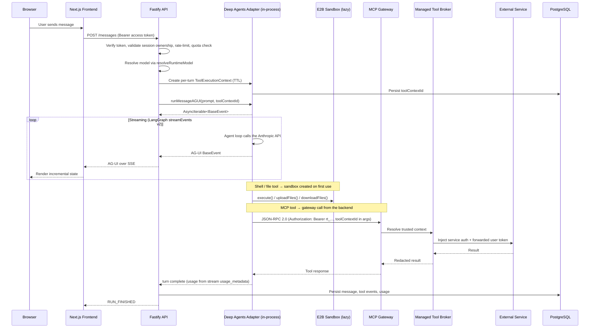

# Cogniplane Architecture

> **Scope:** The shipped architecture of Cogniplane Core. Operational details (commands, file paths, env vars) live in `CLAUDE.md`. Authoritative schema lives in `apps/backend/db/migrations/`.

## Overview

Cogniplane Core is a multi-tenant agent platform with a backend-controlled agent runtime. The backend owns auth, persistence, tool security, session lifecycle, policy compilation, event normalization, and the admin control plane. The runtime provides multi-step planning, tool orchestration, approvals, and richer streaming behavior than a thin LLM-plus-tool-loop stack.

The runtime is **Deep Agents** — LangChain's [deepagentsjs](https://reference.langchain.com/javascript/deepagents) — running **in-process in the Fastify backend** (`services/deep-agents/deep-agents-runtime-adapter.ts`). The library version is pinned via the exact `deepagents` version in `apps/backend/package.json`.

E2B provides a **code-execution sandbox**: a per-session Firecracker VM created **lazily on first shell/file tool use**. Chat-only sessions never create one, and when the tenant's `allowCommandExecution` is off, no sandbox is attached at all.

## Technology Stack

| Layer | Technology | Notes |
|---|---|---|
| Frontend | Next.js 16 | Deployable to any Next.js host (Vercel, Cloudflare Workers via `@opennextjs/cloudflare`, Node container, etc.) |
| Backend | Fastify (ESM TypeScript) | API, session lifecycle, in-process agent loop, MCP gateway, scheduler, policy compilation, audit, streaming |
| Runtime | LangChain [deepagentsjs](https://reference.langchain.com/javascript/deepagents) (LangGraph agent loop, in-process) | Multi-provider via `initChatModel` (Anthropic/OpenAI/Google/OpenRouter/Z.AI); per-provider tenant key or platform env fallback |
| Agent state | LangGraph `PostgresSaver` checkpointer | Postgres schema `deep_agents`; `thread_id` == session id |
| Sandbox | E2B Firecracker VM (`deep-agents-runtime-dev` template) | Lazy, per-session, code-execution only — no agent CLIs or SDKs inside |
| Database | PostgreSQL with Row-Level Security | One DB pool for `app_user` (RLS-active), one for migrations (superuser); the checkpointer manages its own named `app_user` pool |
| Cache / coordination | Redis (optional) | When configured: shared rate limits, refresh token `jti` revocation, turn quotas. Without it, rate limits are per-process. |
| Object storage | S3-compatible bucket (production), local filesystem (dev) | Artifacts and skill bundles share `ARTIFACT_BUCKET_*` credentials |
| Auth | WorkOS (SAML / OIDC / AuthKit) or `dev-headers` mode for local hacking | HS256 JWT access tokens (15 min) + httpOnly refresh cookies (7 day, Redis-revocable) |
| PII Provider | LLM-based detector + rule-based fallback | Opt-in per tenant; bring your own model provider via the `PII_*` env-var contract |

## Repository Layout

The repo is a pnpm workspace.

```
apps/backend             # Fastify API, Deep Agents runtime, MCP gateway, admin config, workers
apps/frontend            # Next.js 16 UI (chat workspace, admin workbench, user settings)
packages/shared-types    # Shared API contracts (Zod schemas) used by both apps
docker/                  # Backend Dockerfile + E2B code-execution template
docs/                    # Architecture, decisions, security features, guides
```

### Backend module map

- `routes/` — HTTP entrypoints. Hot path: `messages.ts`, `mcp.ts`, `approvals.ts`. Admin: `routes/admin/admin-*.ts`. Auth: `auth.ts`. Health, models, sessions, settings, artifacts, tenant.
- `services/deep-agents/` — the runtime: `deep-agents-runtime-adapter.ts` (RuntimeAdapter), `deep-agents-graph.ts` (agent construction), `deep-agents-e2b-backend.ts` (lazy sandbox backend), `deep-agents-checkpointer.ts` (durable state), `stream-events-to-agui.ts` (LangGraph to AG-UI).
- `services/runtime/` — runtime-adjacent lifecycle: `runtime-model-resolver.ts`, `provider-credentials.ts`, `runtime-session-store.ts`, `idle-teardown.ts`, `stale-approval-sweeper.ts`, `e2b-sandbox.ts`.
- `services/dynamic-config-*` — compile admin config from Postgres into the per-turn runtime-policy snapshot.
- `services/managed-tools/` — first-party tool implementations (session tools, `write_artifact`, memory tools, skill-corpus tool, GitHub, Notion).
- `services/managed-tools/factory.ts`, `services/managed-tools/catalog.ts` (+ `register-builtin-managed-tools.ts`), `services/redact-secrets.ts` — managed-tool dispatch (factory wires deps; catalog enumerates the allowlist) + audit redaction.
- `services/policy/` — Policy Center rule evaluation, rule storage, and decision evidence.
- `services/*-store.ts` — tenant-scoped persistence modules.
- `services/pii/*`, `services/pii/openai-compatible-pii-provider.ts` — PII detection/transform pipeline.
- `services/scheduler-*` — cron-driven scheduler worker for user-owned scheduled jobs.
- `services/integrations/` — third-party connection lifecycle (GitHub, Notion).
- `services/skills/` — skill import/lifecycle, bundle storage, marketplace, improvement corpus.
- `services/artifacts/` — artifact storage, processing, and workspace sync.
- `lib/db.ts` — `withTenantScope` (RLS activation wrapper used by every tenant-scoped store call).

## Request Lifecycle


```mermaid
sequenceDiagram
    participant B as Browser
    participant F as Next.js Frontend
    participant A as Fastify API
    participant DA as Deep Agents Adapter (in-process)
    participant SB as E2B Sandbox (lazy)
    participant MCP as MCP Gateway
    participant TB as Managed Tool Broker
    participant Ext as External Service
    participant PG as PostgreSQL

    B->>F: User sends message
    F->>A: POST /messages (Bearer access token)
    A->>A: Verify token, validate session ownership, rate-limit, quota check
    A->>A: Resolve model via resolveRuntimeModel
    A->>DA: Create per-turn ToolExecutionContext (TTL)
    DA->>PG: Persist toolContextId
    A->>DA: runMessageAGUI(prompt, toolContextId)
    DA-->>A: AsyncIterable<BaseEvent>

    loop Streaming (LangGraph streamEvents v2)
        DA->>DA: Agent loop calls the Anthropic API
        DA-->>A: AG-UI BaseEvent
        A-->>F: AG-UI over SSE
        F-->>B: Render incremental state
    end

    Note over DA,SB: Shell / file tool → sandbox created on first use
    DA->>SB: execute() / uploadFiles() / downloadFiles()

    Note over DA,MCP: MCP tool → gateway call from the backend
    DA->>MCP: JSON-RPC 2.0 (Authorization: Bearer rt_..., toolContextId in args)
    MCP->>TB: Resolve trusted context
    TB->>Ext: Inject service auth + forwarded user token
    Ext-->>TB: Result
    TB-->>MCP: Redacted result
    MCP-->>DA: Tool response

    DA-->>A: turn complete (usage from stream usage_metadata)
    A->>PG: Persist message, tool events, usage
    A-->>F: RUN_FINISHED
```

`POST /messages` (`routes/messages.ts`) validates input, resolves the model via `resolveRuntimeModel`, then hijacks the raw socket, sets SSE headers, and delegates to `streamAssistantReplyAGUI` (`services/sse-stream-writer-agui.ts`). The writer builds a `ToolExecutionContext` and calls `runtimeAdapter.runMessageAGUI`. There is a single runtime adapter, with no provider map or provider-resolution step.

## Runtime Architecture

### Single-runtime model

`DeepAgentsRuntimeAdapter` (`services/deep-agents/deep-agents-runtime-adapter.ts`) implements the `RuntimeAdapter` contract. It lazily builds a per-session deepagentsjs agent (`createDeepAgent`) and runs each turn as a LangGraph `streamEvents` v2 stream inside the backend process. `stream-events-to-agui.ts` maps those envelopes directly to AG-UI `BaseEvent` values consumed by the browser and scheduler.

Agent construction lives in `deep-agents-graph.ts`:
- **Model** — multi-provider `initChatModel` via `resolveModelConstruction` (maps a catalog id to `<initPrefix>:<vendorModel>` + base URL per `MODEL_PROVIDER_META`): Anthropic, OpenAI, Google (`google-genai`), OpenRouter and Z.AI (both via the OpenAI client with a custom base URL). The key is resolved per-provider for the selected model (`provider-credentials.ts`): the tenant's stored key first, then the platform env fallback. Reasoning effort is baked in per provider by `applyReasoningEffort`. The in-process loop calls each provider's API directly. Token usage is captured from stream `usage_metadata` and persisted per turn.
- **State** — the shared Postgres checkpointer (below); `thread_id` is the session id, so multi-turn resume is a checkpointer read, and threads survive process restarts.
- **Sandbox** — the lazy E2B backend (below) when `allowCommandExecution` is on; otherwise no sandbox, no `execute` tool, and file tools fall back to deepagents' checkpointed StateBackend.
- **MCP tools** — a `MultiServerMCPClient` (`@langchain/mcp-adapters`) speaking streamable HTTP from the backend to the platform's own `/mcp/:serverId` gateway, authenticated with a session-scoped `Authorization: Bearer rt_...` header (URLs never carry `?token=`; the gateway rejects query-param tokens). The per-turn `toolContextId` is injected into managed tool args at call time via the client's top-level `beforeToolCall` hook, always overriding any model-supplied value. Tools load per-server with degradation (one broken server skips its tools, not all), and names colliding with deepagents built-ins (`RESERVED_BUILTIN_TOOL_NAMES`) or duplicated across servers are dropped with a warning.
- **Approvals** — an `interruptOn` map (LangGraph human-in-the-loop middleware) built from the tenant's approval settings; see Approval Flow.

### Durable state (checkpointer)

`deep-agents-checkpointer.ts` wires a LangGraph `PostgresSaver` into its own Postgres schema **`deep_agents`**, with an explicit named pool. DDL runs from `migrate.ts` (superuser) via `setupDeepAgentsCheckpointer`; the runtime saver connects as `app_user`. **The checkpointer tables have no tenant column and no RLS** — isolation is app-layer: `thread_id` IS the session id, and every route that reaches the checkpointer resolves the session through the RLS-scoped `sessions` table first. Session deletion purges the thread; idle teardown does not.

### E2B sandbox backend

`deep-agents-e2b-backend.ts` implements `E2bDeepAgentsSandbox extends BaseSandbox` (deepagents' sandbox protocol — the library has no official E2B backend). It implements `execute()`/`uploadFiles()`/`downloadFiles()` over the E2B JS SDK and overrides `ls`/`read`/`grep`/`glob` to remap "/"-rooted paths into the session workspace (`/home/user/workspace/<sessionId>/`); workspace-escaping paths return the protocol's structured error. The sandbox is **created on first use and memoized per session** — chat-only sessions never pay for one. A per-command timeout (`DEEP_AGENTS_EXECUTE_TIMEOUT_MS`, default 2 min) and a 64k output cap are enforced at this layer; `E2B_SANDBOX_TIMEOUT_MS` (default 30 min) caps sandbox lifetime.

The template (`docker/template.ts`, name `deep-agents-runtime-dev`, built by `make e2b-build`, id wired via `E2B_TEMPLATE_ID`) is deliberately a dumb code-execution box: the stock `e2bdev/base` image plus Python 3 with a pinned knowledge-worker data stack (pandas, openpyxl, matplotlib, jinja2), ripgrep/sqlite3/git — **no agent CLIs or SDKs**. Building under the same name updates the template in place, preserving its id; cutover/rollback is an `E2B_TEMPLATE_ID` env change.

### Session lifecycle

- One session runtime per active session, created on demand, torn down after `RUNTIME_IDLE_TIMEOUT_MS` (`services/runtime/idle-teardown.ts`). Teardown kills the sandbox but leaves the checkpointer thread — conversations resume across teardowns and process restarts.
- Runtimes emit lifecycle audit events (start, resume, idle teardown, interrupt).
- A per-turn watchdog (`RUNTIME_TURN_TIMEOUT_MS`, default 20 min) aborts a wedged turn via the graph's abort signal; it is disarmed while an approval prompt is pending, and config validation pins it above `APPROVAL_REQUEST_TTL_MS` and below `E2B_SANDBOX_TIMEOUT_MS`.
- Turn failures surface client-safe messages: 4xx provider errors pass through; internals collapse to a generic message.

## System Prompt & Skill Pipeline

There is **no rendered workspace config** — the adapter assembles the agent **system prompt at session start**: tenant `developerInstructions` + recent long-term memories (gated on `memory_search` enablement and a Policy Center evaluation). Skills are NOT inlined into the prompt — `buildSkillsLibraryFiles` renders each enabled skill to a read-only `/skills/<slug>/SKILL.md` (plus materialized bundle companion files), mounted as a `CompositeBackend` route and surfaced by the native deepagents skills middleware. Progressive disclosure: only each skill's name/description/path reaches the prompt; the model `read_file`s the full SKILL.md on demand.

Config is compiled from Postgres by `DynamicConfigService` (`services/dynamic-config-service.ts`) and snapshotted onto the per-turn `ToolExecutionContext`.

### Skill data flow

```
SKILL.md body → validateSkillBundle → buildSkillImportPayload
  → importSkillBundle (merges skillName/description/instructions INTO metadata JSONB)
  → activateSkillRevision (reads metadata.skillName + metadata.instructions — fails if absent)
  → compileRuntimeConfig → DeepAgentsRuntimeAdapter.createSession
  → buildSkillsLibraryFiles → read-only /skills/<slug>/ library (generated SKILL.md + bundle companions)
  → native deepagents skills middleware (progressive disclosure in the system prompt)
```

`instructions` lives in `revision.metadata->>'instructions'` (NOT a column). Skills with a null `bundle_storage_uri` use inline instructions.

### Skill bundle storage

Skill bundles (zipped `SKILL.md` + companion files) have two storage backends, chosen by `SKILL_BUNDLE_STORAGE_BACKEND`:

- **`local`**: bundles live at `<SKILL_BUNDLE_STORAGE_ROOT>/<bundleName>/<contentHash>/`. Suitable for `make dev`; ephemeral on container deployments where `/tmp` does not survive task replacement.
- **`bucket`** (production): bundles upload as `.tar.gz` to S3 at `s3://<bucket>/<prefix>/skills/<tenantId>/<skillId>/<revisionNumber>-<contentHash>.tar.gz`. On session start, `installBundle` downloads and extracts on demand into `<SKILL_BUNDLE_CACHE_ROOT>/...`. The cache is content-addressed and idempotent.

Each `admin_skill_revisions` row stores the canonical `bundle_storage_uri` (`file://` or `s3://`); the scheme selects the backend at runtime.

## MCP Gateway & Tool Security

`/mcp/:serverId` (`routes/mcp.ts`) receives JSON-RPC 2.0 from the runtime's `MultiServerMCPClient`. Two modes per server:

- **managed** — the call dispatches to the `ManagedToolFactoryRegistry` (`services/managed-tools/factory.ts`, `createDefinitions`). The `ManagedToolCatalog` (`services/managed-tools/catalog.ts`, registered in `register-builtin-managed-tools.ts`) aggregates per-domain catalogs: session tools, `write_artifact`, memory tools, the skill-corpus tool, GitHub tools, Notion tools.
- **proxy** — forwarded to an upstream URL with framework context headers injected.

Every tool call requires a `toolContextId` resolved against `ToolExecutionContextStore`. The context carries `userId`, `sessionId`, `runtimeId`, and a snapshot of the tenant's effective runtime config (compiled from `tenant_settings`) — the model never sees credentials directly.

Tool results pass through `redactSecrets()` (`services/redact-secrets.ts`) before persistence to strip auth headers and tokens.

### Trust boundary

```
Frontend --[JWT]--> Backend --+-- Deep Agents loop (in-process; toolContextId only, never user tokens)
                              |
                              +--[Bearer rt_... + toolContextId]--> MCP Gateway
                                                        |
                                  +----------managed----+----proxy----+
                                  |                                    |
                      Managed Tool Broker            Forward validated user token/context
                                  |                                    |
                          External Service               Downstream MCP server enforces auth
```

Rules:
1. Never give user JWTs or bearer tokens to the model. The agent loop receives only `toolContextId` and compiled policy.
2. Never trust model-supplied identity fields. The model cannot author `user_id`, `session_id`, or `auth_token` in tool arguments — `beforeToolCall` overwrites `toolContextId` on every managed call.
3. Validate provenance server-side on every tool call. Verify session ownership before routing.
4. Authorization stays at the service boundary. Managed tools enforce downstream access via the tool broker; enterprise MCP servers enforce their own.
5. Sandbox workspaces are isolated per session. File tools remap "/"-rooted paths into the session workspace and refuse escapes.
6. Tool event payloads are scrubbed of tokens, auth headers, and credentials before being written to Postgres.
7. Tool execution contexts expire (`TOOL_CONTEXT_TTL_MS`, validated strictly above `RUNTIME_TURN_TIMEOUT_MS`).
8. Stored OAuth credentials and runtime tokens are encrypted at rest with AES-256-GCM (`lib/crypto-utils.ts`, scrypt-derived key memoized per process).

## Approval Flow

Native runtime approvals and Policy Center approvals share one checkpointed graph interrupt, frontend event shape, approval row, and decision route.

**Native HITL approvals are LangGraph interrupt-based.** `tenant_settings.approval_policy` (`"never"` bypasses gating) drives an `interruptOn` map built in `deep-agents-graph.ts`: all MCP gateway tools (minus read-only ones when `auto_approve_read_only_tools` is on) plus the mutating built-ins (`execute`, `write_file`, `edit_file`), plus the read-only built-ins when the read-only bypass is off. An interrupt pauses the graph **before** tool execution and checkpoints; the adapter detects pending interrupts after the stream ends, persists an approval row, emits an AG-UI `CUSTOM` event named `approval_required`, and resumes the graph with a `Command` once decided. Resume is keyed **per interrupt id**, so concurrent interrupts (parallel `task` subagents each hitting a gated tool) get their own decisions.

The frontend calls `POST /approvals/:approvalId/decision` with `{ decision: "approve" | "reject", rememberForTurn?: boolean }` (`routes/approvals.ts`), which persists the decision and resumes the paused graph.

Policy Center `require_approval` is folded into the runtime's checkpointed graph interrupt. Once approved, the runtime injects a deterministic `policyApprovalId`; the gateway proceeds only when the row matches the same session, user, tool, server, tool context, and canonical argument hash. This keeps the gateway fail-closed without a held HTTP response or second coordinator, and scheduled turns use the same durable interrupt.

MCP elicitation is not a separate confirmation plane in Cogniplane: authorization and human confirmation are enforced at the Cogniplane MCP gateway through native HITL and Policy Center. Configured upstream MCP tools must not rely on elicitation as their only guardrail.

### TTL and expiry

Pending approvals carry a wall-clock TTL (`APPROVAL_REQUEST_TTL_MS`, default 10 min). On expiry the DB row moves to `status='expired'`, an `approval.expired` audit event is written, an AG-UI `CUSTOM` event named `runtime_notice` (level `warning`, `noticeId = approval-expired:<approvalId>`) is pushed to the active turn so the frontend can clear the prompt, and the paused graph is resumed with a reject. Rows also carry a DB-level `expires_at`, so a process death still lets the startup sweep (`services/runtime/stale-approval-sweeper.ts`) recover them.

## Policy Center

Policy Center is a tenant-scoped rule layer evaluated at the MCP gateway before a managed or proxy tool action is executed. Rules are evaluated in ascending `priority` order (ties broken by rule id); the admin UI rewrites priorities via drag-and-drop reordering. Each rule has a simple `condition -> effect` shape.

Effects are `allow`, `require_approval`, and `block`. Conditions have four active dimensions: `toolNames`, `categories` (the managed-tool domain or proxy MCP server id), `severities` (`read_only`, `file_change`; the legacy `command_execution` value is still accepted but never matches an action), and `turnContexts` (`interactive`, `scheduled`). Dimensions are AND-ed together; multiple values inside a dimension are OR-ed; an omitted dimension matches anything.

`tenant_settings.policy_enforcement_mode` is the tenant-level switch. `monitor` evaluates rules and writes `policy_decision` evidence for matches without gating execution; `enforce` applies gating effects. The mode is compiled into the runtime-policy snapshot on the per-turn `ToolExecutionContext`, so the hot path does not read tenant settings from Postgres. Only matched rules write `policy_decision` rows.

## Tenant Settings

`tenant_settings` is one row per tenant — the single source of truth for runtime policy. The `system` tenant's row acts as the platform default; effective config merges the tenant row over the system row.

Owners exclusively control `allowCommandExecution`. Admins may update the remaining Agent Settings, but unchanged copies of that owner-only field are removed from admin writes to prevent stale forms from overwriting an owner decision.

| Field | Purpose |
|---|---|
| `enabled_tool_ids` | Allowlist of managed tool ids exposed to the agent |
| `enabled_mcp_server_ids` | Allowlist of MCP servers exposed to the agent |
| `approval_policy` | Native HITL gating (string policy or granular object; `"never"` bypasses) |
| `approval_reviewer` | Who resolves runtime-native approvals (default `user`) |
| `auto_approve_read_only_tools` | Bypass approval for read-only tools |
| `policy_enforcement_mode` | Policy Center mode: `"monitor"` or `"enforce"` |
| `allow_command_execution` | Gate on shell/exec tools — when off, no sandbox is attached at all |
| `developer_instructions` | Extra system prompt content per tenant |
| `web_search_mode` | Web search availability for the agent |
| `show_effort_selector` | Frontend feature flag |

Per-tenant model-provider keys (one per provider — Anthropic/OpenAI/Google/OpenRouter/Z.AI) are managed via organization settings and stored encrypted per-provider in `tenant_org_settings`.

## Admin Configuration

Three admin entities, all tenant-scoped with `tenant_id = 'system'` rows acting as platform defaults:

| Entity | Store | Notes |
|---|---|---|
| Skills | `SkillConfigStore` + `SkillRevisionStore` | Revisions hold `skillName`, `description`, `instructions` in `metadata` JSONB. Activation requires all three |
| MCP servers | `McpServerStore` | `mode` is `managed` or `proxy` |
| Tenant settings | `TenantSettingsStore` | One row per tenant (see above) |

Admin endpoints live under `routes/admin/admin-*.ts`. Authorization uses `requireRole(request, 'admin' | 'owner')`.

### Integrations registry

`tenant_integrations` + `IntegrationRegistry` track which third-party integrations a tenant has enabled (GitHub App, Notion). `routes/admin/admin-integrations-routes.ts` exposes the management CRUD; per-user OAuth tokens land in `user_github_connections`, `user_notion_connections`.

### Skill marketplace

A marketplace manifest URL (per tenant or via `SKILL_MARKETPLACE_MANIFEST_URL` platform default) lets tenants discover and import skill bundles published outside their own tenant. Caching is controlled by `SKILL_MARKETPLACE_CACHE_TTL_MS`.

### Skill usage telemetry & improvement

Skill adoption is tracked by Tier 1 telemetry. `ActivationTracker` (`services/activation-tracker.ts`) writes `resource_activations` rows inline on the hot path: a `materialized` row when a skill is inlined into the session's system prompt, and an `invoked` row when a tool call routed through the MCP gateway matches a skill's `associatedToolIds`.

Improving a skill is a normal agent turn, not a bespoke worker. The built-in `skill-improver` skill calls the `read_skill_corpus` managed tool with a target `skillId`; the tool assembles a redacted markdown corpus of recent sessions where the skill was offered or used plus the current SKILL.md, and returns it inline. The agent proposes a revised SKILL.md via `write_artifact`.

## PII Pipeline

PII detection is opt-in (`PII_PROVIDER_ENABLED`). The pipeline targets any OpenAI-compatible `/chat/completions` endpoint (or a native Ollama `/api/chat` endpoint via `PII_LLM_WIRE_FORMAT`), parameterized by the `PII_LLM_*` env vars; you bring your own model provider (a hosted API or a self-hosted Ollama/vLLM server) and accept that vendor's logging posture. The default configuration points at OpenRouter (default model `google/gemini-2.5-flash`) with a rule-based fallback for when the LLM endpoint is unavailable or times out.

Two paths:
- **Sync** — message text passes through `PiiProtectionService.evaluateText` (`services/pii/pii-protection-service.ts`, invoked from `routes/messages.ts`) before being forwarded to the runtime. Detect/block/transform actions are configured per tenant.
- **Async** — `pii_scan_runs` + `pii_scan_jobs` queue scans of stored content (artifacts, message history). Findings persisted with severity and category.

Configuration knobs: `PII_LLM_API_KEY`, `PII_LLM_MODEL`, `PII_LLM_BASE_URL`, `PII_LLM_WIRE_FORMAT`, `PII_PROVIDER_TIMEOUT_MS`.

## Scheduler

`services/scheduler-worker.ts` polls `scheduled_jobs` every `SCHEDULER_POLL_INTERVAL_MS` (default 30s), claims due jobs atomically, and runs them as synthetic agent turns. Results land in `scheduled_job_runs`. Concurrency capped by `SCHEDULER_MAX_CONCURRENT_JOBS`; per-job hard timeout via `SCHEDULER_JOB_TIMEOUT_MS`.

Each job carries a `settings_snapshot_json` so executions remain auditable even after the user later changes their preferences.

## Multi-Tenancy & RLS

- **One DB, many tenants.** All tenants share the same PostgreSQL instance and schema.
- **Explicit `tenant_id` columns** on every data table. Every store method takes `tenantId` as its first argument.
- **Row-Level Security** as the second enforcement layer. RLS policies use `current_setting('app.current_tenant_id', true)`; if the application forgets to set the tenant context, RLS returns an empty result set.

Two DB pools:
- `db` — `app_user` (non-superuser, RLS-active).
- `privilegedDb` — superuser, used only for `getDownloadToken` (where the token IS the auth) and migration runs.

The Deep Agents checkpointer additionally manages its own named `app_user` pool. Its tables (schema `deep_agents`) have **no RLS** — isolation is app-layer via the RLS-scoped `sessions` table (see Runtime Architecture).

Every tenant-scoped store call wraps its work in `withTenantScope(db, tenantId, fn)` (`lib/db.ts`), which sets `SET LOCAL app.current_tenant_id` inside a transaction.

## Authentication

Production uses `AUTH_MODE=workos`:

| Endpoint | Purpose |
|---|---|
| `GET /auth/login` | Redirect to WorkOS authorization URL |
| `POST /auth/callback` | Code exchange → upsert tenant/user/membership → JWT + refresh cookie |
| `POST /auth/refresh` | Rotate refresh token (new jti) → new access token |
| `POST /auth/logout` | Revoke jti → clear cookie |
| `GET /auth/me` | Current user, tenant, role |

**Access token**: HS256, 15-minute TTL, carried in `Authorization: Bearer`. Held in React state (memory) only — never persisted to localStorage or sessionStorage.

**Refresh token**: httpOnly, `SameSite=None`, `Secure`, scoped to the **backend domain**. 7-day TTL. Each token carries a unique `jti` stored in Redis. Every refresh rotates the `jti` (delete old, store new). Logout deletes immediately.

**First-member owner promotion**: the auth callback wraps tenant upsert, user upsert, membership count, and membership upsert in a single transaction. The count is taken before the new membership is inserted, so the first user to authenticate into a new organization atomically receives `owner`.

The Deep Agents runtime requires at least one model-provider API key (Anthropic, OpenAI, Google, OpenRouter, or Z.AI) — a per-provider tenant key or a platform env fallback. `/models` filters the catalog to models whose provider is configured, returning an empty list as the "configure a key" state when none is present.

### Public auth paths

Backend auth middleware uses an explicit `publicAuthPaths` allowlist (`apps/backend/src/lib/auth-workos.ts`) — login, callback, refresh, logout, GitHub install + user callbacks. `/auth/me` is **not** public. Frontend route protection lives in `apps/frontend/src/middleware.ts` with a hard-coded public allowlist plus a session-hint cookie.

### Roles

```
owner  → full access; tenant settings; member management
admin  → admin config (skills, MCP, tenant settings); audit log; member management
member → create and use sessions
```

`requireRole(request, ...roles)` is called at the start of elevated routes.

## Streaming contract

`POST /messages` streams native AG-UI `BaseEvent` values as data-only SSE frames. The backend does not emit separate `event:` lines or the retired `response.*` and `framework:*` envelopes.

The stream uses native AG-UI lifecycle, text, reasoning, tool-call, tool-result, and state-delta events. Cogniplane-specific approval, runtime-notice, tool metadata, tool status, and UI-resource payloads use AG-UI `CUSTOM` events. `write_todos` updates `/plan` through `STATE_DELTA`.

Active stream event names and payload shapes follow AG-UI `BaseEvent` schemas from `@ag-ui/client`, not hand-maintained markdown.

### Concurrency

The backend rejects concurrent turns on the same session with HTTP 429.

## Persistence

The authoritative schema is `apps/backend/db/migrations/`. `001_init.sql` is the consolidated baseline and `002_seed_system_data.sql` seeds the system tenant; everything after them is incremental. `migrate.ts` also runs the Deep Agents checkpointer DDL (schema `deep_agents`, tables managed by LangGraph's `PostgresSaver`). Below is a summary of the live tables — types and constraints are illustrative.

### Identity

| Table | Notes |
|---|---|
| `tenants` | Includes `slug`, `workos_org_id`, `custom_domain`, `settings_json` |
| `users` | Includes `workos_user_id` |
| `tenant_memberships` | `(tenant_id, user_id)` PK; `role` ∈ {owner, admin, member} |

### Sessions & runtime

| Table | Notes |
|---|---|
| `sessions` | App-level chat sessions; `purpose` column classifies `normal` chat vs `scheduled` |
| `runtime_sessions` | Per-session runtime mapping; `runtime_provider` (default `deep-agents`), `runtime_version`, `runtime_schema_version`, `manifest_path`, `manifest_metadata`, `lifecycle_metadata` |
| `messages` | `role`, `status`, `content_text`; token usage recorded inline |
| `message_tool_results` | Streamed tool results joined to a parent message |
| `tool_events` | Audit-grade tool call log; `phase`, `status`, redacted `payload` |
| `tool_execution_contexts` | Short-lived per-turn credentials carrier (TTL via `expires_at`) |
| `approvals` | Approval state machine; `kind`, `status`, `decision`, `resolved_at` |
| `deep_agents.*` | LangGraph checkpointer tables (conversation state); no tenant column, no RLS — app-layer isolation via `sessions` |

### Artifacts

| Table | Notes |
|---|---|
| `artifacts` | Tenant-scoped, source-traced via `source_artifact_id` |
| `artifact_download_tokens` | Short-lived signed download tokens |

### Admin config

| Table | Notes |
|---|---|
| `tenant_settings` | One row per tenant — runtime policy source of truth |
| `policy_rule` | Ordered Policy Center rules: conditions, effect, reason, enabled flag |
| `policy_decision` | Evidence rows for matched Policy Center rules |
| `admin_skills` | Tenant-scoped skill catalog with `active_revision_id` pointer |
| `admin_skill_revisions` | Versioned bundles; `bundle_storage_uri` (`file://` or `s3://`); `metadata.instructions` |
| `admin_mcp_servers` | Tenant-scoped MCP server registry; `mode` ∈ {managed, proxy} |

### Integrations & connections

| Table | Notes |
|---|---|
| `tenant_integrations` | Per-tenant integration enablement |
| `user_github_connections` | OAuth tokens encrypted at rest |
| `user_notion_connections` | OAuth tokens encrypted at rest |

### Workers & quality

| Table | Notes |
|---|---|
| `scheduled_jobs` / `scheduled_job_runs` | User-owned scheduler |
| `pii_scan_runs` / `pii_scan_jobs` | Async PII scan pipeline |
| `resource_activations` | Tier 1 skill/MCP/integration usage telemetry |

### User settings

| Table | Notes |
|---|---|
| `user_settings_sections` | Sectioned per-user preferences (`scheduled_jobs`, `skills`, `mcp`, `model`, etc.) |

### Audit

| Table | Notes |
|---|---|
| `audit_events` | `event_type`, `payload`, `ip_address` (INET), `user_agent` |

## Security Posture

| Layer | Mechanism |
|---|---|
| Transport | HSTS, `X-Frame-Options: DENY`, `X-Content-Type-Options: nosniff`, `Referrer-Policy: strict-origin-when-cross-origin`, restrictive CSP |
| Request tracing | `X-Request-Id` on every response |
| Secrets at rest | AES-256-GCM via `encrypt()` / `decrypt()` (`lib/crypto-utils.ts`); scrypt-derived key (N=16384, r=8, p=1), memoized per process |
| URL log redaction | Fastify request logs sanitize sensitive query params (e.g. `?token=`, `?apiKey=`) via `lib/sanitize-url.ts` (defense in depth) |
| Audit | `audit_events` captures `ip_address` (INET) and `user_agent` on every admin and auth action |
| CSRF | Refresh cookie is httpOnly, backend-scoped, sent only to the configured CORS origin |
| Tool result redaction | `redactSecrets()` strips known secret patterns before persistence |
| MCP token transport | Session-scoped `Authorization: Bearer rt_...` header only; the gateway rejects query-param tokens |

For the full security control inventory, see [SECURITY_FEATURES.md](SECURITY_FEATURES.md).

## Observability

- Backend logs via Fastify's pino logger. `console.*` calls are limited to pre-Fastify boot paths (`config.ts`, `lib/redis.ts` defaults) and CLI scripts (`migrate.ts`, `seed-dev-data.ts`).
- `audit_events` is the durable audit log.
- `tool_events` is the durable tool-call log (redacted payloads).
- `resource_activations` records Tier 1 skill/MCP/integration usage per session.
- Cost tracking: per-turn usage is captured from LangGraph stream `usage_metadata` and persisted on `messages` (`input_tokens`, `cached_input_tokens`, `output_tokens`, `reasoning_output_tokens`, `total_tokens`, `model_name`, `cost_usd`).

## Environment

Full schema with defaults is in `apps/backend/src/config.ts`. Production-relevant non-obvious knobs:

```
E2B_API_KEY                      # Required — shell/file tools execute inside E2B; boot fails fast without it
E2B_TEMPLATE_ID                  # Deep Agents code-execution template id (docker/template.ts, `make e2b-build`)
E2B_SANDBOX_TIMEOUT_MS           # Sandbox lifetime cap (default 30 min)
DEEP_AGENTS_EXECUTE_TIMEOUT_MS   # Per-execute() wall-clock budget inside the sandbox (default 2 min)
RUNTIME_TURN_TIMEOUT_MS          # Per-turn watchdog (default 20 min); must exceed APPROVAL_REQUEST_TTL_MS, stay under E2B_SANDBOX_TIMEOUT_MS
TOOL_CONTEXT_TTL_MS              # Per-turn tool-context lifetime; validated strictly above RUNTIME_TURN_TIMEOUT_MS
RUNTIME_GATEWAY_BASE_URL         # URL the runtime's MCP client uses to reach /mcp
ARTIFACT_STORAGE_BACKEND=bucket  # S3-backed artifacts in production
SKILL_BUNDLE_STORAGE_BACKEND=bucket
SKILL_BUNDLE_BUCKET_NAME         # Reuses ARTIFACT_BUCKET_* credentials
ANTHROPIC_API_KEY                # Platform-level Anthropic key (tenant per-provider key overrides). Peers: OPENAI_API_KEY / GOOGLE_API_KEY / OPENROUTER_API_KEY / ZAI_API_KEY
PII_PROVIDER_ENABLED             # Validates the configured PII provider's API key at boot when true
SCHEDULER_ENABLED=true
AUTH_MODE=workos                 # Production
WORKOS_API_KEY / WORKOS_CLIENT_ID / WORKOS_REDIRECT_URI
JWT_SECRET                       # Refresh token signing — must differ from default in prod
DATA_ENCRYPTION_SECRET           # Symmetric secret encryption — must differ from default in prod
REDIS_URL                        # Required when AUTH_MODE=workos (jti revocation, rate limits)
MIGRATION_DATABASE_URL           # Superuser DSN; bypasses RLS for migrations + checkpointer DDL only
```

## Historical note: retired dual-runtime architecture

Earlier versions of Cogniplane ran two sandbox-hosted runtimes. OpenAI's `codex app-server` and an in-sandbox Claude Agent SDK harness shared an E2B template and rendered workspace config. That architecture and its custom SSE envelopes are gone. The current in-process [deepagentsjs](https://reference.langchain.com/javascript/deepagents) runtime streams AG-UI over data-only SSE frames.

## Pointers

- `CLAUDE.md` — operational runbook for working in this repo (commands, file paths, env vars, gotchas)
- [SECURITY_FEATURES.md](SECURITY_FEATURES.md) — full security control inventory
- [DECISIONS.md](DECISIONS.md) — architectural decision records
- <https://reference.langchain.com/javascript/deepagents> — official deepagentsjs API reference
- `apps/backend/db/migrations/` — authoritative schema
